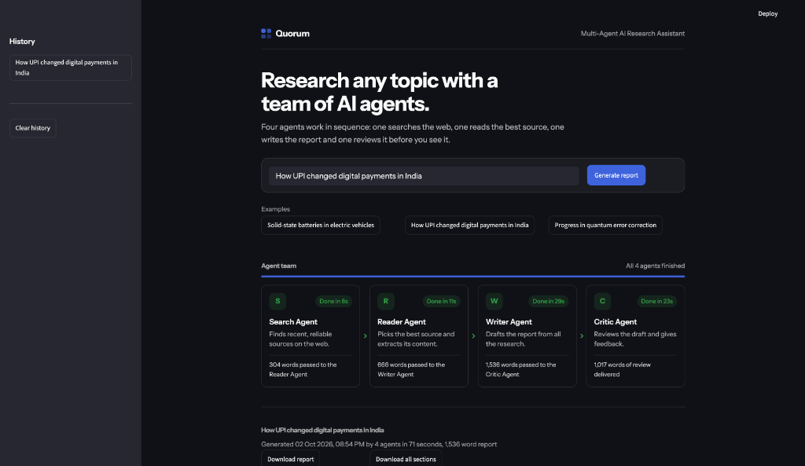
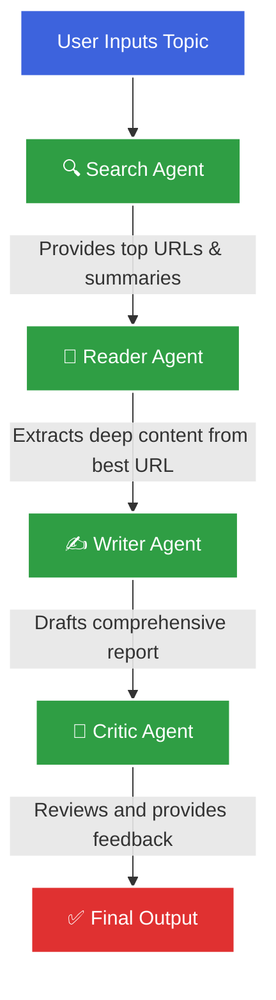

# 🔷 Quorum: Multi-Agent AI Research Assistant

<p align="center">
  
</p>

**Quorum** is a powerful multi-agent AI research pipeline powered by [LangChain](https://python.langchain.com/) and [LangGraph](https://python.langchain.com/docs/langgraph), featuring a modern, highly responsive frontend built with [Streamlit](https://streamlit.io/). 

Instead of relying on a single LLM prompt, Quorum coordinates a specialized **team of four AI agents**. These agents work collaboratively in a linear sequence to automate end-to-end web research, comprehensive analysis, and high-quality report generation.

---

## 🏗️ Architecture & Pipeline

Quorum uses a stateful agentic workflow. Each agent has a specific role, acting on the data provided by the previous agent.



### The Agent Team
1. **Search Agent (The Scout):** Uses the Tavily API to browse the live web, finding recent and reliable sources related to the user's topic.
2. **Reader Agent (The Scholar):** Analyzes the search results, selects the single most authoritative URL, and scrapes its deep content.
3. **Writer Agent (The Author):** Takes the raw research from the Search and Reader agents and drafts a structured, highly detailed, and readable Markdown report.
4. **Critic Agent (The Editor):** Reviews the Writer's draft for accuracy, tone, and completeness, providing constructive feedback and a final score.

---

## 🛠️ Technology Stack

- **Agent Orchestration:** LangGraph & LangChain
- **Language Models (LLMs):** Mistral AI (`open-mistral-nemo`) for fast and high-quality generation
- **Web Search & Scraping:** Tavily API & BeautifulSoup
- **Frontend / UI:** Streamlit (Custom styled with `Instrument Sans` and a beautiful dark-mode interface)

---

## 🚀 Setup & Installation

### 1. Clone the repository
```bash
git clone https://github.com/sakshamsingh22/quorum-multi-agent-research.git
cd quorum-multi-agent-research
```

### 2. Create a virtual environment
```bash
python3 -m venv venv
source venv/bin/activate  # On Windows use: venv\Scripts\activate
```

### 3. Install dependencies
```bash
pip install -r requirements.txt
```

### 4. Configure Environment Variables
Create a `.env` file in the root directory and add your API keys. You will need keys for Mistral (LLM) and Tavily (Search).
```env
MISTRAL_API_KEY=your_mistral_api_key_here
TAVILY_API_KEY=your_tavily_api_key_here
```
*(Optional)* If you plan to switch to Groq or Google Gemini in the future, you can add `GROQ_API_KEY` and `GEMINI_API_KEY` as well.

---

## 💡 Usage

Run the Streamlit frontend to start generating reports:
```bash
streamlit run app.py
```
Open your browser at `http://localhost:8501`. Enter any topic in the search bar and watch the AI agents collaborate in real-time to build your report!

---

## 📂 Project Structure

```text
├── agents.py           # Defines the LangChain LLMs and agent chains (Search, Reader, Writer, Critic)
├── pipeline.py         # The LangGraph state machine orchestrating the agent sequence
├── tools.py            # Web search and scraping utilities
├── app.py              # The Streamlit UI and visual frontend
├── requirements.txt    # Python dependencies
└── .env                # (Not in repo) API Keys
```
